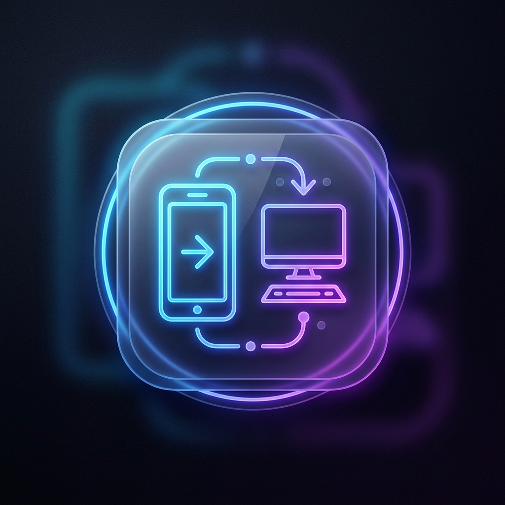
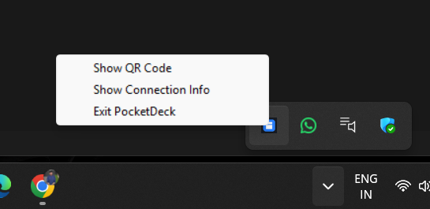

<div align="center">
  

  # 📱 PocketDeck
  ### Your PC, in your pocket.
  
  **PocketDeck** is a high-performance, low-latency mobile companion that transforms any smartphone into a professional control surface for your Windows PC. Turn your phone into a precision touchpad, a full-scale keyboard, a real PTY terminal, and a customizable automation hub—all over your local network.

  [](dist/PocketDeck.exe)
  [](https://github.com/nikhil2004-blip/quickon/releases)
  [](https://github.com/nikhil2004-blip/quickon)
  [](https://github.com/nikhil2004-blip/quickon)
</div>

---

## 🌟 Overview

Unlike generic remote desktop tools, **PocketDeck** is designed for speed and invisibility. It runs as a lightweight background service in your system tray, providing instant access to your PC's core functions without the overhead of a video stream. Whether you're a developer managing servers from across the room or a power user controlling media from the couch, PocketDeck delivers sub-20ms response times and a premium mobile experience.

## 🚀 Key Features

### 🖱️ Zero-Latency Touchpad
*   **Precision Tracking:** Hardware-accelerated movement with smoothing and jitter suppression.
*   **Intuitive Gestures:** Tap-to-click, two-finger scroll, and drag-lock for complex window management or screenshot selection.
*   **Dark Mode UI:** A minimalist, premium interface designed for high-end OLED mobile screens.

### ⌨️ Full Laptop Emulation
*   **Native Keyboard:** Send text, symbols, and special characters using your phone's native keyboard.
*   **Power Shortcuts:** Dedicated keys for `Ctrl`, `Alt`, `Shift`, `Win`, and `Tab`. Easily execute combinations like `Alt+Tab`, `Win+D`, or `Ctrl+C`.
*   **Bulk Typing:** Paste long strings or command lines directly from your mobile clipboard.

### 💻 The "Killer" Terminal
*   **Real PTY Session:** Not just a command executor. This is a live, persistent PowerShell/CMD session with full ANSI color support.
*   **Interactive Power:** Use `vim`, `htop`, or Python REPLs directly from your phone.
*   **Tab Autocomplete:** Full support for shell-native tab completion and command history.

### 🎛️ Customizable Widgets & Media
*   **One-Tap Automation:** Launch apps, run scripts, or execute complex workflows via `widgets.yaml`.
*   **Media Center:** Dedicated controls for Play/Pause, Volume, and Track switching.
*   **Tray Integration:** Stay organized with a silent, system-tray-first approach.

---

## 🛠️ Getting Started

### For Users (Fastest Setup)
1.  **Download:** [Download PocketDeck.exe](dist/PocketDeck.exe) directly from this repository or grab it from the [Releases](https://github.com/nikhil2004-blip/quickon/releases) page.
2.  **Launch:** Double-click the EXE. PocketDeck will start silently in your Windows System Tray.
3.  **Connect:** Right-click the tray icon and select **Show QR Code**. Scan the code with your phone and you're ready to go!

### For Developers
If you wish to run from source or contribute:
```bash
# Clone the repository
git clone https://github.com/nikhil2004-blip/quickon.git
cd quickon

# Set up virtual environment
python -m venv .venv
.\.venv\Scripts\activate

# Install dependencies
pip install -r server/requirements.txt

# Run the server
python server/server.py
```

---

## 📖 How to Use

### Step 1: Locate the Tray Icon
Once launched, PocketDeck hides in your system tray (near the clock). Right-click it to access the management menu.

<p align="center">
  
  <br />
  <em>Right-click the icon to pair your phone or view connection info.</em>
</p>

### Step 2: Scan and Connect
Scan the QR code displayed on your PC. Your phone will open the PocketDeck Web Interface. No mobile app installation is required!

### Step 3: Add to Home Screen (Optional)
For a native-app feel, use your mobile browser's **"Add to Home Screen"** option. This enables full-screen mode and removes browser UI distractions.

---

## ⚙️ Customizing Widgets

You can create your own automation buttons by editing `server/widgets.yaml`. Define sequences of terminal commands, application launches, or key presses:

```yaml
widgets:
  - id: start-dev
    label: "Start Dev"
    icon: "🚀"
    actions:
      - type: terminal
        command: "cd projects/my-app && npm run dev\r"
      - type: launch
        app: "code"
        args: ["."]
```

---

## 🔒 Security & Privacy

*   **Local Only:** PocketDeck works exclusively over your local Wi-Fi. No data ever leaves your network.
*   **Token-Based:** Every session is protected by a randomly generated auth token to prevent unauthorized access.
*   **Zero Tracking:** We don't collect logs, metrics, or usage data. Your PC stays yours.

---

## 🏗️ Architecture

*   **Backend:** Python (`asyncio`, `websockets`, `pynput`). Uses a split-thread architecture to ensure input serialization and eliminate cursor lag.
*   **Frontend:** Vanilla HTML5/CSS3/JS. Powered by `xterm.js` for the terminal and `requestAnimationFrame` for buttery-smooth 60fps tracking.
*   **Packaging:** Compacted into a single-file executable using PyInstaller for zero-config deployment.

---

## 🤝 Contributing

Contributions are welcome! Feel free to open issues or submit pull requests for new features, bug fixes, or UI improvements.

---

<div align="center">
  <p>Built with ❤️ for power users and developers.</p>
  <p><strong>PocketDeck — Take control of your workstation.</strong></p>
</div>
